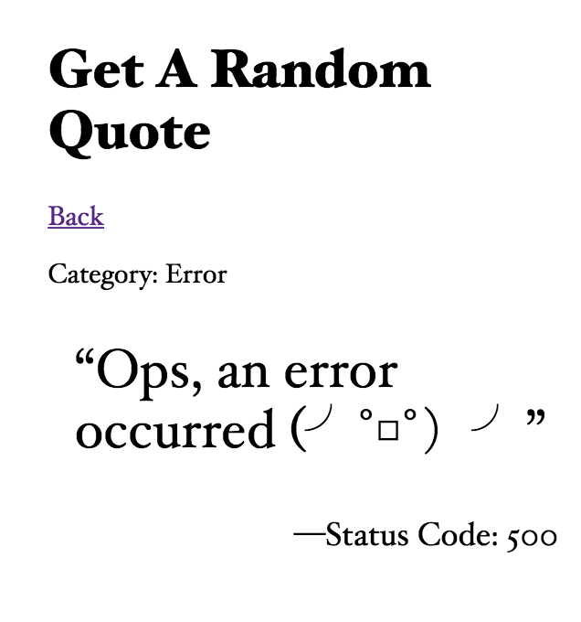

# Kontinentalist Technical Test

## Live Deployment

<https://stormy-falls-77526.herokuapp.com/>

## Task

Perform an API call to the API below.

<https://market.mashape.com/andruxnet/random-famous-quotes>

Create a select option to choose between the categories which will then generate a random quote.

# Brief Walkthrough

## Landing Page

<p align="center"></p>

Use the dropdown list to select "Movies", "Famous" or "Random" category, then press Submit.

## Quote Page

<p align="center"></p>

An API call be made to retrieve a random quote of the desired category and displayed as shown above.

Press Back to get the next random quote.

## API Rate Limit

<p align="center"></p>

If the API rate limit is reached, just for fun, the error message will also be rendered as if it were a quote as shown above.

# Development Log

**20/03/2018**

- Created Git repository and added Git remote origin
- Created following files
    - `./.gitignore`
    - `./package.json`
    - `./README.md`
    - `./app.js`
    - `./controller.js`
    - `./routes.js`
    - `./views/layouts/main.handlebars`
    - `./views/home.handlebars`
- Installed following packages
    - `express`
    - `body-parser`
    - `path`
    - `nodemon`
    - `express-handlebars`
    - `unirest`
- Created `/` route with `get` and `post`
- Created dropdown list to select quote category and submit button
- Wrote API `get` request through `unirest`
- Created template to display retrieved quote

**21/03/2018**

- Added `if-else` statement checking the status code of API call to detect error message
- Deployed to Heroku
- Added API key to Heroku `Config Vars`, i.e., environment variables
- Added reference to environment variable and commented out lines referencing `config.js` for for API key
- Added brief walkthrough and further development log to `README.md`


# Shell Command Reference

```
git init
git remote add origin https://github.com/limjiechao/kontinentalist.git
git add .
git commit -am "added .gitignore"
git push -u origin master
npm init
npm i express --save
npm i path --save
npm i body-parser --save
npm i nodemon --save
npm i unirest --save
npm i express-handlebars --save
heroku create
git push heroku master
heroku config:set APP_KEY=<API_KEY_HERE>
heroku open
```

# Resources

- <https://docs.rapidapi.com/docs/unirest>
- <http://unirest.io/nodejs.html>
